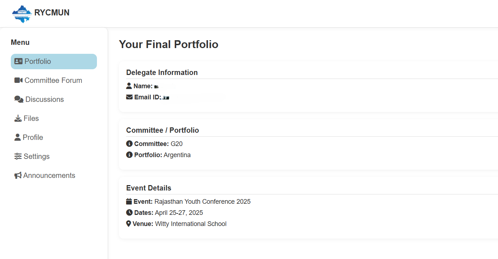

# RYC MUN — Website + ESP32 NFC Attendance System


> Management system for RYC Model UN — delegate registration website + ESP32/NFC attendance hardware synced to Firebase in real time.

🌐 **Live site:** [rycmun.com](https://rycmun.com)



---

## Overview

Two systems working together for RYC Model United Nations:

**1. Website** — delegate registration portal where participants apply, receive their committee assignments, and view the event schedule. Built in vanilla JavaScript + Firebase.

**2. NFC Attendance Hardware** — ESP32 + PN532 NFC reader that logs check-ins to Firebase in real time when delegates tap their delegate ID cards. Attendance reports auto-generated after each session.

---

## Website Features

- Delegate registration form with committee preference selection
- Email confirmation via Firebase Cloud Functions
- Admin dashboard: view all registrations, assign committees, export list
- Live schedule page (content managed via Firestore)
- Mobile-first, fast — deployed on Firebase Hosting

---

## NFC Hardware

| Component | Detail |
|-----------|--------|
| Controller | ESP32 DevKit v1 |
| NFC reader | PN532 (I2C mode) |
| Display | 0.96" OLED (SSD1306) |
| Indicator | RGB LED (status feedback) |
| Power | USB-C or 5V barrel jack |
| Enclosure | 3D-printed shell |

Each delegate ID card has an NFC sticker pre-programmed with their unique UID. The PN532 reads the UID, the ESP32 looks it up in a local cache, and logs the check-in to Firebase Realtime Database.

---

## How the Attendance Works

```
Delegate taps NFC card
  ↓
PN532 reads UID (I2C)
  ↓
ESP32: UID → delegate lookup (local JSON cache)
  ↓
Firebase RTDB: write timestamp + delegate name + session ID
  ↓
OLED: show "✓ Welcome, [Name]" or "✗ Unknown"
  ↓
Dashboard: live attendance table auto-updates
```

**Offline resilience** — if WiFi drops, check-ins are queued in SPIFFS and bulk-synced when connectivity returns. No check-ins lost.

---

## Firmware

```bash
git clone https://github.com/kavinjainn/ryc-nfc
cd firmware/

# Required libraries (Arduino IDE / PlatformIO):
# - Adafruit_PN532
# - Adafruit_SSD1306
# - FirebaseESP32
# - ArduinoJson

# Set credentials in firmware/config.h
# WIFI_SSID, WIFI_PASS, FIREBASE_HOST, FIREBASE_AUTH
pio run --target upload
```

---

## Website Setup

```bash
cd web/
npm install
npm run dev

# Deploy
firebase deploy --only hosting
```

---

## Firebase Structure

```
/registrations/{uid}
  name, email, committee, status, timestamp

/attendance/{session}/{uid}
  name, committee, timestamp, tapCount

/schedule/{day}/{slot}
  title, location, committee
```

---

## Used at RYC MUN

The system handled 200+ delegates across 3 days of the conference. Check-in time reduced from ~8 min manual to ~3 seconds per delegate.

---

## About

Built by [Kavin Jain](https://kavinjain.in) as Head of Operations for RYC MUN.
